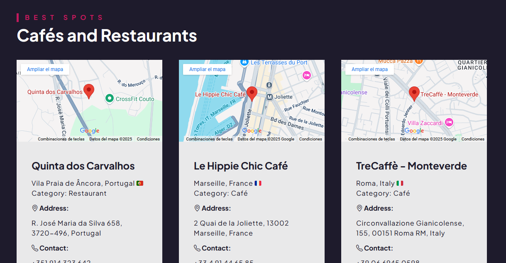
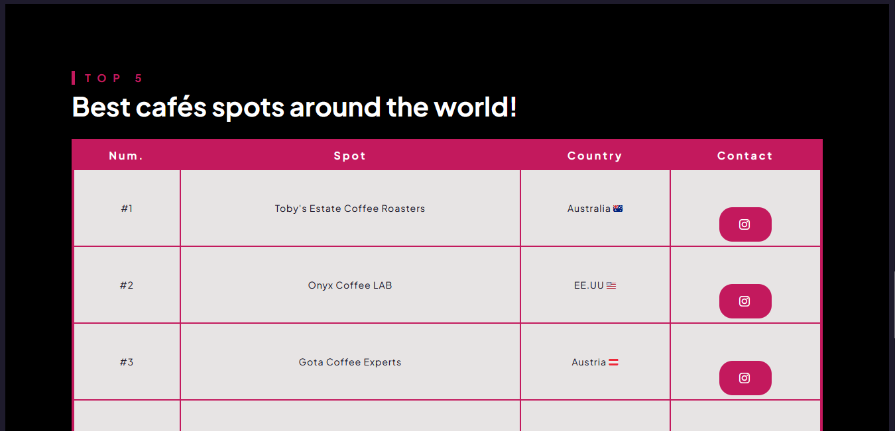

## 📍 Recommendation spots website

😊 This is a responsive website featuring recommendations for international cafés and restaurants. Through this platform, the goal is to inspire others to discover new places, support local businesses, and enjoy global cuisine in cozy and unique settings.

💡 Built with HTML, CSS and JavaScript. 

The website is hosted on <a href="https://travelers-spots.netlify.app/">Netlify</a>

### Best international spots ✨

### Top 5 Best International spots ⭐🤩

